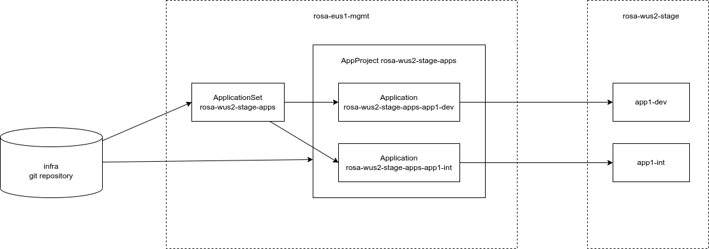

# gitops-example-infra

This is a proof-of-concept repository. The repository contains a directory structure for managing multiple OpenShift clusters as well as deploying applications to these clusters using GitOps. The repository leverages several building blocks:

* **Argo CD AppProjects** are used for **controlling access** to target clusters and for **organizing Applications**. AppProjects control which Kubernetes manifests can be deployed to which clusters and namespaces. AppProjects also help with organizing the Applications. In Argo CD web UI one can list Applications that belong to a specific AppProject.

* **Argo CD ApplicationSets** are used to create Argo CD Application objects. ApplicationSets generate Argo CD Application objects from a common template. Using a common template improves **consistency** between Applications and **decreases the amount of repetitive yaml code** that we would need to maintain.

* **Git repositories** host Kubernetes manifests for configuring clusters and deploying applications. Manifests in the Git repository must be organized into a directory structure described in this document. Git repositories can have different access permissions. This allows to **control who is allowed to modify which Kubernetes manifests**.

## Clusters and environments

Each cluster can host multiple environments. Examples of typical environments are:

* lab
* dev
* int
* test
* stage
* prod

A single application is typically deployed into multiple environments. For each environment a separate Kubernetes namespace is allocated. We do not deploy multiple applications into a single namespace. Each application receives its own set of namespaces, one namespace per environment. The application development version is deployed to a *dev* environment. The application integration is performed in the *int* environment. Application QA testing is carried out in the *test* environment. The tested application version can be deployed into a *stage* environment right before it is finally deployed to a *prod* environment.

For example, to support the lifecycle of one application *app1*, the following namespaces would be created in the three clusters:

Lab cluster:
* *app1* (lab environment)

Stage cluster:
* *app1-dev*
* *app1-int*
* *app1-test*
* *app1* (stage environment)

Production cluster:
* *app1* (production environment)

As can be seen in the above example, the Kubernetes namespace name is a combination of the application name and the environment name separated by a dash character.

## Git repositories

Manifests in the Git repository must be organized into a directory structure described in this document. The well-defined directory structure allows automated creation of Applications using ApplicationSets. Kubernetes manifests that will be applied to the cluster can come from different Git repositories. In our example, we define two Git repositories:

* **gitops-example-infra** git repository hosts the definitions of Argo CD AppProjects and ApplicationSets. It also includes Kubernetes manifests for configuring clusters. Administrator access is required to make cchanges in this repository.
* **gitops-example-apps** git repository hosts Kubernetes manifests for deploying applications. This repository is supposed to be used by developers for deploying their applications into various environments.

## Directory structure

In the following example an application *app1* is being deployed. Kubernetes manifests for deploying the application are managed using Kustomize. The Kustomize base manifests are stored in the the *base* directory. For each target cluster and environment where the application is going to be deployed a separate Kustomize overlay is created. This overlay are located under the *overlays* directory. The subdirectories under the *overlay* directory include the cluster name and environment name. For example, *overlays/rosa-wus2-lab/dev* overlay will deploy the application to the *dev* environment on the *rosa-wus2-lab* cluster.

```
apps
apps/app1
apps/app1/base
apps/app1/base/init.sh
apps/app1/base/kustomization.yaml
apps/app1/base/toolbox-container-deploy.yaml
apps/app1/base/toolbox-container-sa.yaml
apps/app1/overlays
apps/app1/overlays/rosa-wus2-lab
apps/app1/overlays/rosa-wus2-lab/lab
apps/app1/overlays/rosa-wus2-lab/lab/argocd_config.yaml
apps/app1/overlays/rosa-wus2-lab/lab/kustomization.yaml
apps/app1/overlays/rosa-wus2-stage
apps/app1/overlays/rosa-wus2-stage/dev
apps/app1/overlays/rosa-wus2-stage/dev/argocd_config.yaml
apps/app1/overlays/rosa-wus2-stage/dev/kustomization.yaml
apps/app1/overlays/rosa-wus2-stage/int
apps/app1/overlays/rosa-wus2-stage/int/argocd_config.yaml
apps/app1/overlays/rosa-wus2-stage/int/kustomization.yaml
```

The *argocd_config.yaml* file contains user-defined properties that will be used while constructing the Argo CD Application manifest:

```
$ cat apps/app1/overlays/rosa-wus2-stage/dev/argocd_config.yaml
appName: app1-dev
destNamespace: app1-dev
```

Currently, there are three properties available. The property *appName* is a unique identifier of the application, *destNamespace* is the Kubernetes namespace where this application will be deployed.

## Deploying

Create the AppProjects and ApplicationSets on the cluster where Argo CD is located:

```
$ oc apply -R -f projects
```

The ApplicationSets with genera Argo CD Applications. Argo CD Applications will create namespace and deploy example application to the clusters.

Git -> Apply Project and ApplicationSets -> Look up argocd_config.yaml -> Generate Application -> Deploy Kubernetes manifests


